# Architecture Overview

## Architecture Style

**Modular Monolith + Vertical Slice Architecture**

This project demonstrates a pragmatic approach to building enterprise applications in 2025, avoiding the over-engineering trap of microservices while maintaining clear module boundaries.

---

## Table of Contents

- [C4 Architecture](#c4-architecture)
  - [Context Diagram](#context-diagram)
  - [Container Diagram](#container-diagram)
  - [Component: Identity Module](#component-identity-module)
  - [Component: Ordering Module](#component-ordering-module)
- [Business Flows](#business-flows)
  - [Order Flow](#order-flow)
  - [Checkout Saga State Machine](#checkout-saga-state-machine)
  - [Authentication Flow](#authentication-flow)
  - [Payment Flow](#payment-flow)
- [Data Architecture](#data-architecture)
  - [Data Ownership Map](#data-ownership-map)
  - [PostgreSQL Schema (Identity & Ordering)](#postgresql-schema)
  - [MongoDB Schema (Catalog)](#mongodb-schema)
  - [Redis Data Structures](#redis-data-structures)
- [Communication Patterns](#communication-patterns)
  - [Module Communication Matrix](#module-communication-matrix)
  - [Outbox Pattern Flow](#outbox-pattern-flow)
  - [SignalR Real-time Flow](#signalr-real-time-flow)

---

## C4 Architecture

### Context Diagram

System context showing external actors and systems.

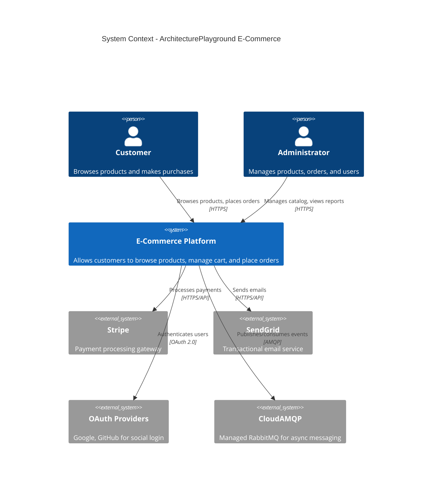

### Container Diagram

High-level technology choices and container interactions.

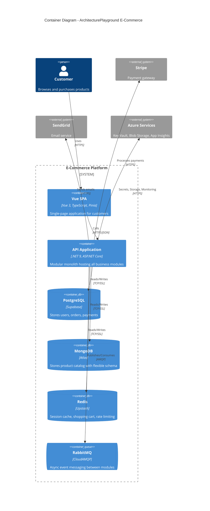

### Component: Identity Module

Internal structure of the Identity module showing vertical slice architecture.

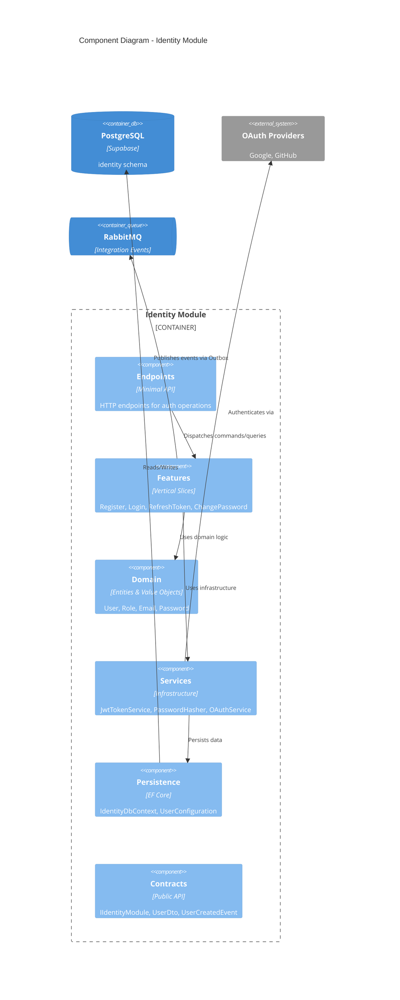

### Component: Ordering Module

Internal structure of the Ordering module with CQRS and Saga patterns.

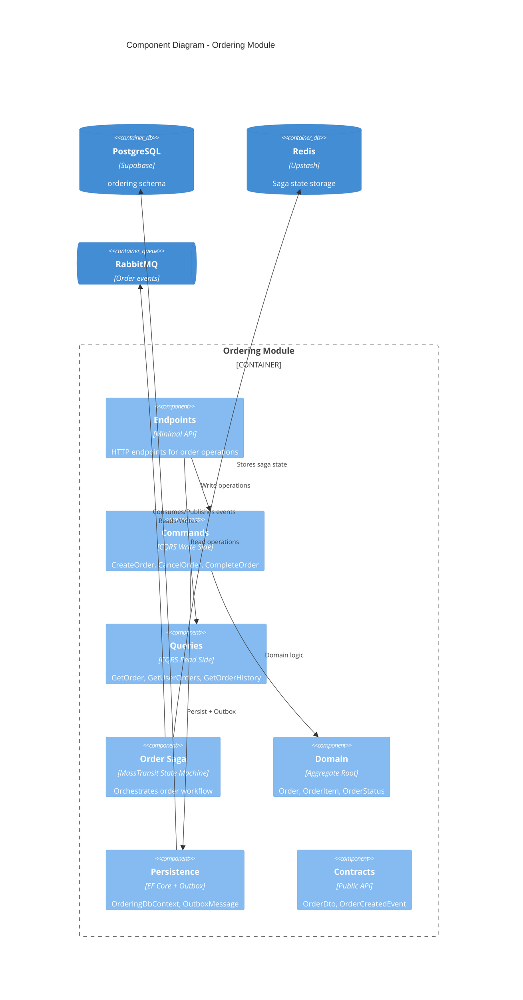

---

## Business Flows

### Order Flow

Complete order lifecycle from cart to delivery.

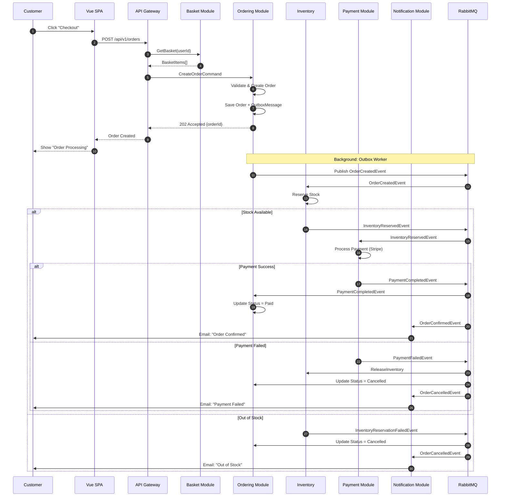

### Checkout Saga State Machine

MassTransit state machine managing order workflow with timeouts and compensation.

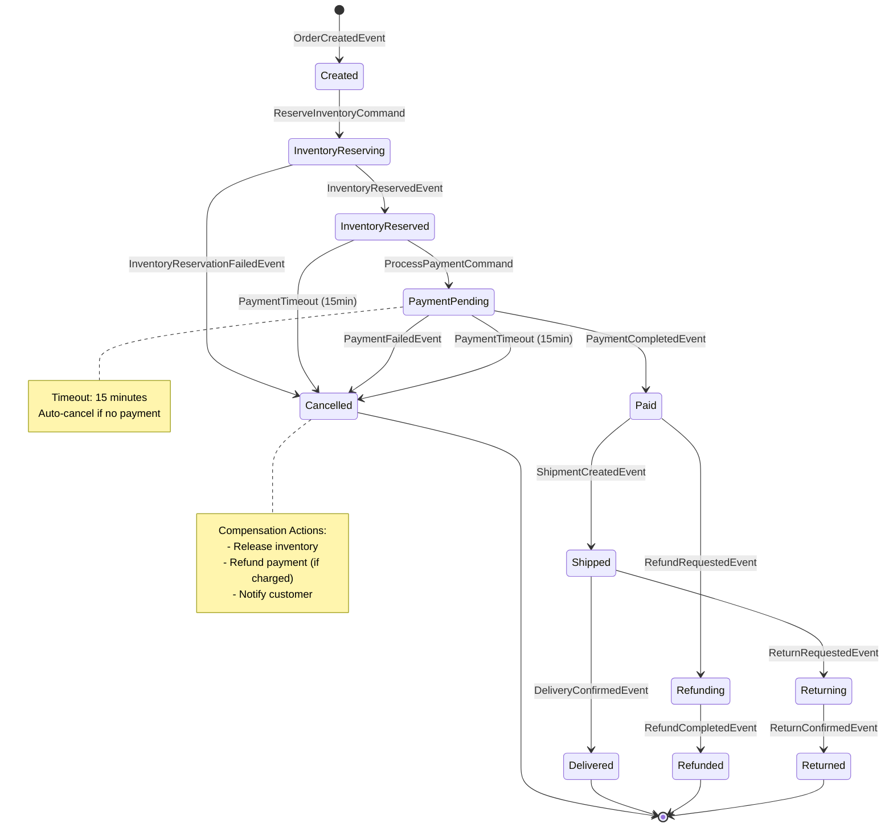

### Authentication Flow

JWT authentication with refresh token rotation.

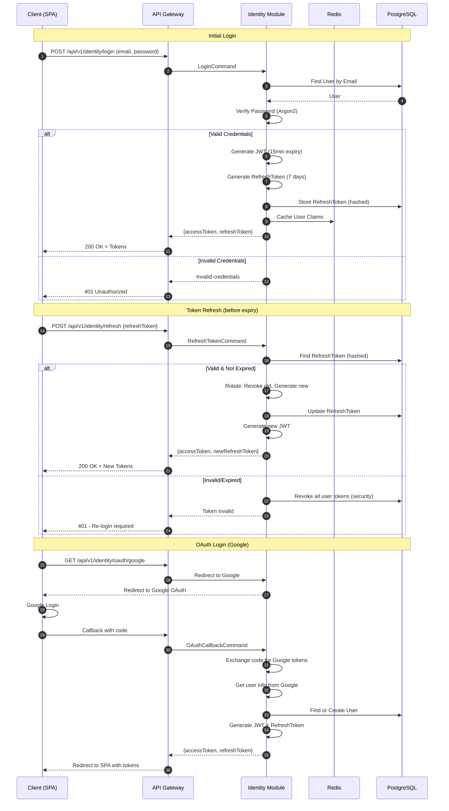

### Payment Flow

Stripe payment processing with idempotency.

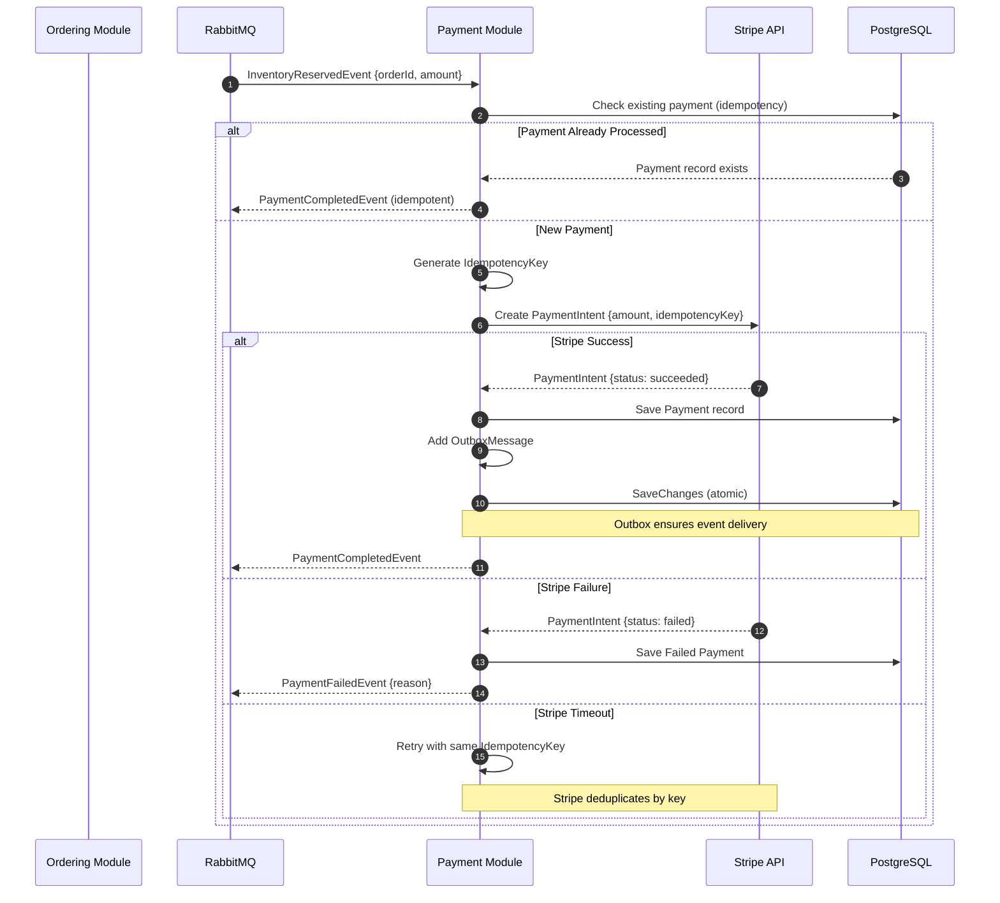

---

## Data Architecture

### Data Ownership Map

Bounded contexts and their data stores.

```mermaid
flowchart TB
    subgraph "Identity Context"
        I[Identity Module]
        I --> PG1[(PostgreSQL<br/>identity schema)]
        I --> R1[(Redis<br/>sessions, rate-limit)]
    end

    subgraph "Catalog Context"
        CA[Catalog Module]
        CA --> MG[(MongoDB<br/>catalog DB)]
        CA --> R2[(Redis<br/>product cache)]
    end

    subgraph "Ordering Context"
        O[Ordering Module]
        O --> PG2[(PostgreSQL<br/>ordering schema)]
        O --> R3[(Redis<br/>saga state)]
    end

    subgraph "Basket Context"
        B[Basket Module]
        B --> R4[(Redis<br/>carts TTL=7d)]
    end

    subgraph "Payment Context"
        P[Payment Module]
        P --> PG3[(PostgreSQL<br/>payment schema)]
    end

    subgraph "Notification Context"
        N[Notification Module]
        N --> PG4[(PostgreSQL<br/>notification schema)]
    end

    subgraph "Analytics Context"
        A[Analytics Module]
        A -.->|Read Replica| PG2
        A -.->|Read Replica| PG3
    end

    subgraph "Shared Infrastructure"
        MQ[RabbitMQ<br/>CloudAMQP]
        AZ[Azure Key Vault<br/>Secrets]
        BL[Azure Blob<br/>Images]
    end

    I & CA & O & B & P & N --> MQ
    I & CA & O & P --> AZ
    CA --> BL

    style PG1 fill:#336791,color:#fff
    style PG2 fill:#336791,color:#fff
    style PG3 fill:#336791,color:#fff
    style PG4 fill:#336791,color:#fff
    style MG fill:#4DB33D,color:#fff
    style R1 fill:#DC382D,color:#fff
    style R2 fill:#DC382D,color:#fff
    style R3 fill:#DC382D,color:#fff
    style R4 fill:#DC382D,color:#fff
    style MQ fill:#FF6600,color:#fff
```

### PostgreSQL Schema

Entity-relationship diagram for Identity and Ordering schemas.

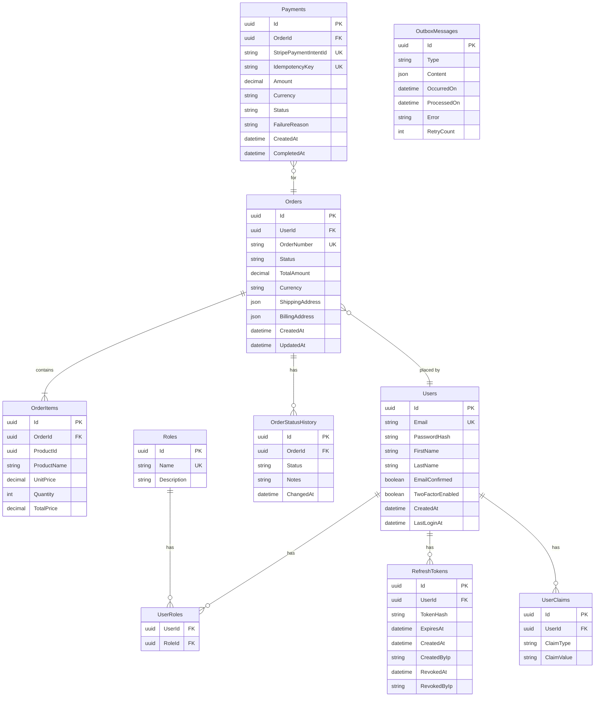

### MongoDB Schema

Document structure for product catalog.

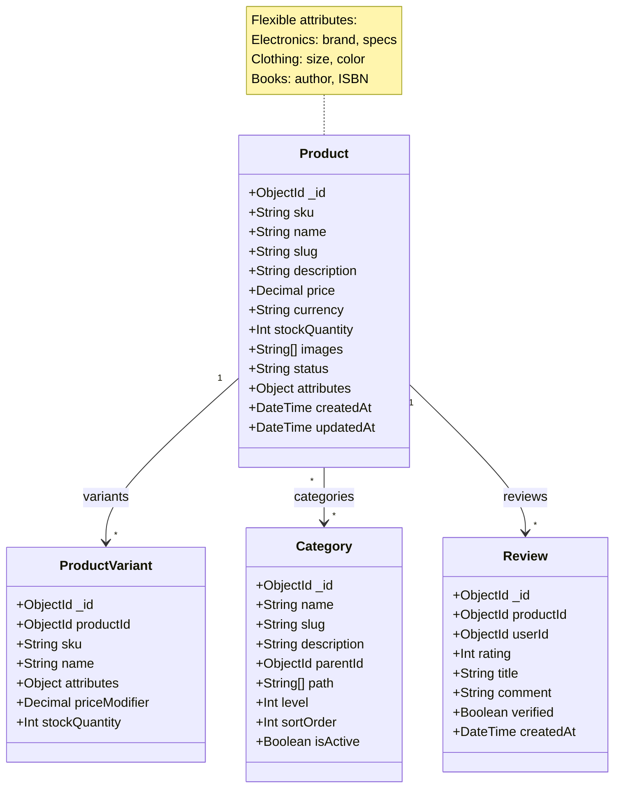

### Redis Data Structures

Redis usage patterns across modules.

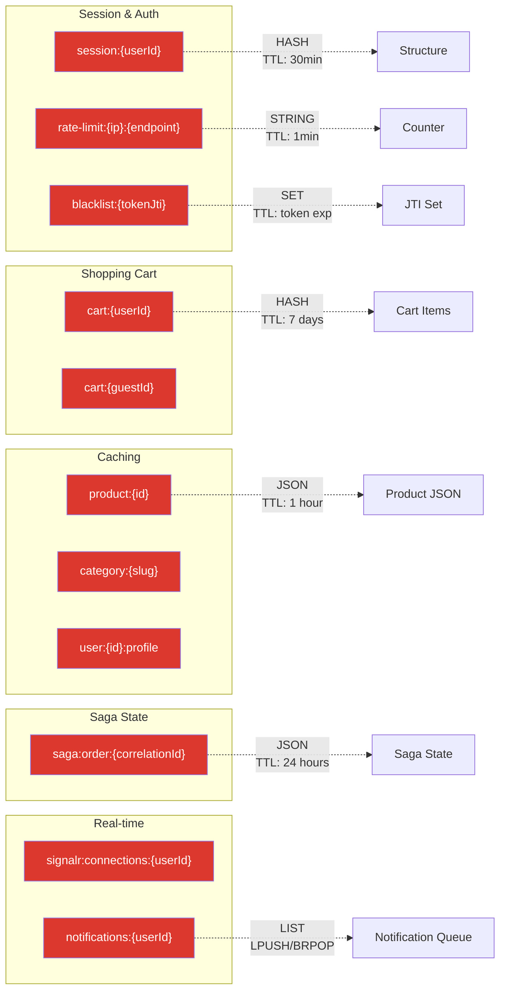

---

## Communication Patterns

### Module Communication Matrix

How modules communicate with each other.

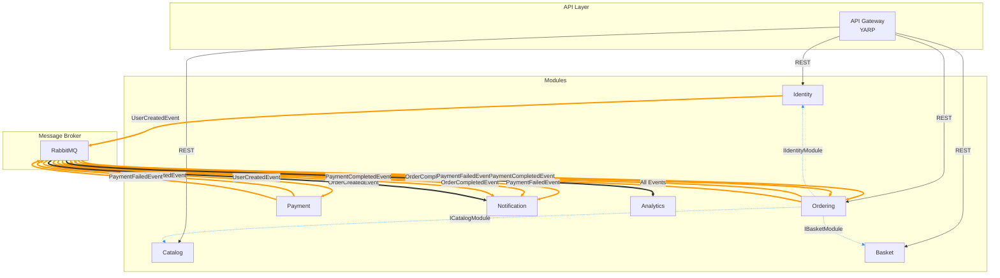

**Legend:**
- Solid arrows (→): HTTP/REST calls
- Dashed arrows (⇢): Synchronous module contracts (in-process)
- Double arrows (⇒): Asynchronous events via RabbitMQ

### Outbox Pattern Flow

Reliable message delivery with transactional outbox.

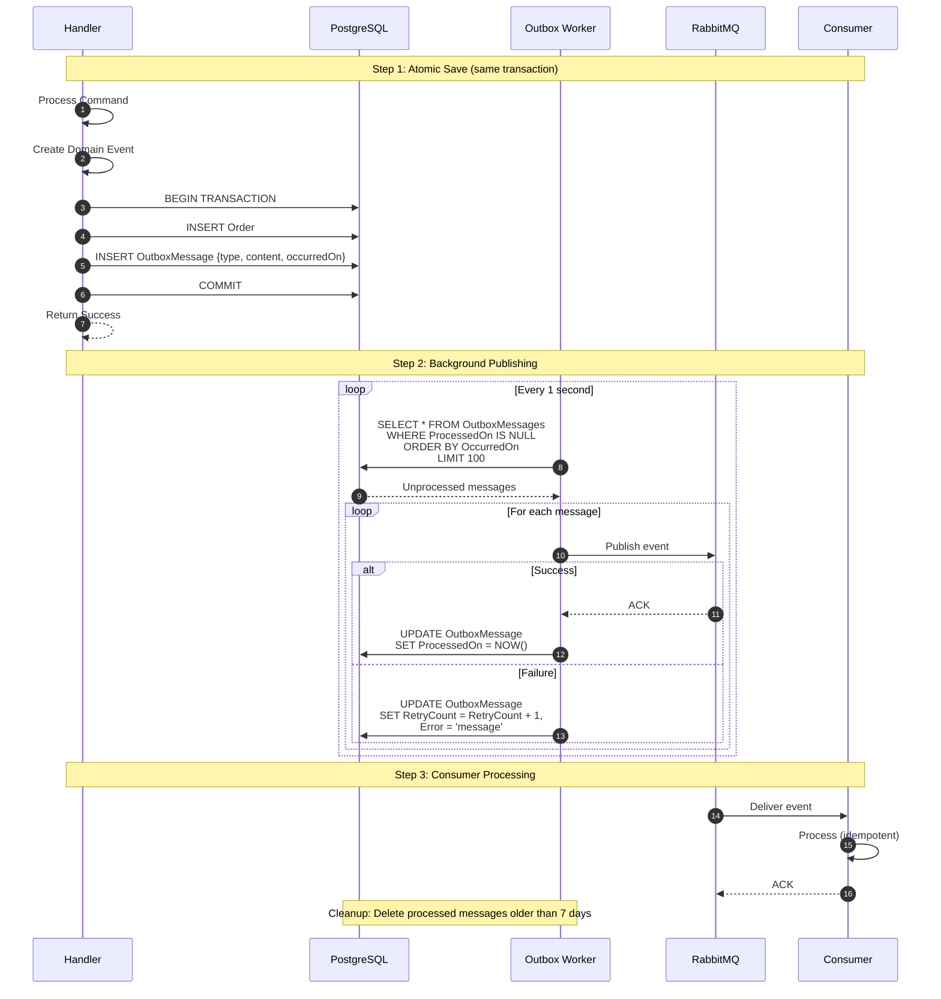

### SignalR Real-time Flow

Real-time notifications to connected clients.

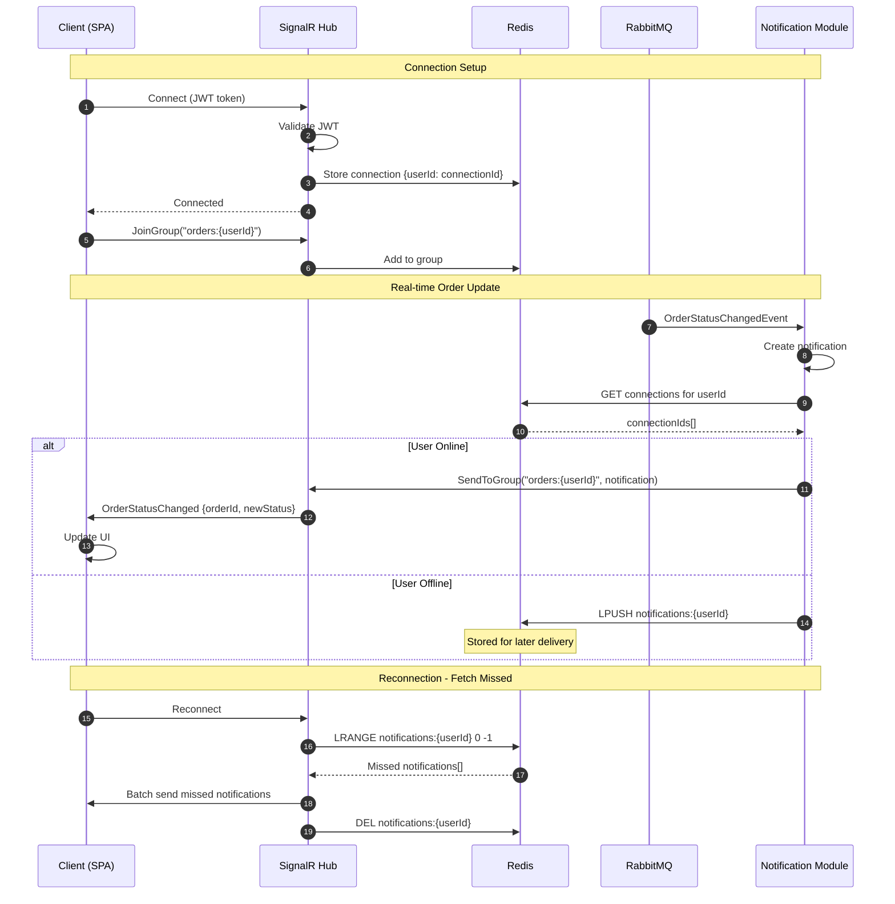

---

## Module Structure

Each business module follows this structure:

```
Module/
├── Module.Core/           # Domain + Application (Features)
│   ├── Features/          # Vertical slices
│   ├── Domain/            # Entities, Value Objects, Events
│   └── Exceptions/        # Domain exceptions
├── Module.Infrastructure/ # External concerns
│   ├── Persistence/       # DbContext, Configurations
│   └── Services/          # External service implementations
└── Module.Contracts/      # Public API
    ├── DTOs/              # Data transfer objects
    └── Events/            # Integration events
```

## Key Architectural Decisions

See [Architecture Decision Records](../adr/) for detailed reasoning behind:

- [ADR-0001: Modular Monolith Architecture](../adr/0001-modular-monolith-architecture.md)
- [ADR-0002: Vertical Slice Architecture](../adr/0002-vertical-slice-architecture.md)
- [ADR-0003: CQRS with MediatR](../adr/0003-cqrs-with-mediatr.md)
- [ADR-0004: Outbox Pattern for Messaging](../adr/0004-outbox-pattern.md)
- [ADR-0005: MongoDB for Catalog](../adr/0005-mongodb-for-catalog.md)

## Tech Stack

See [tech-stack.md](tech-stack.md) for detailed technology choices.
